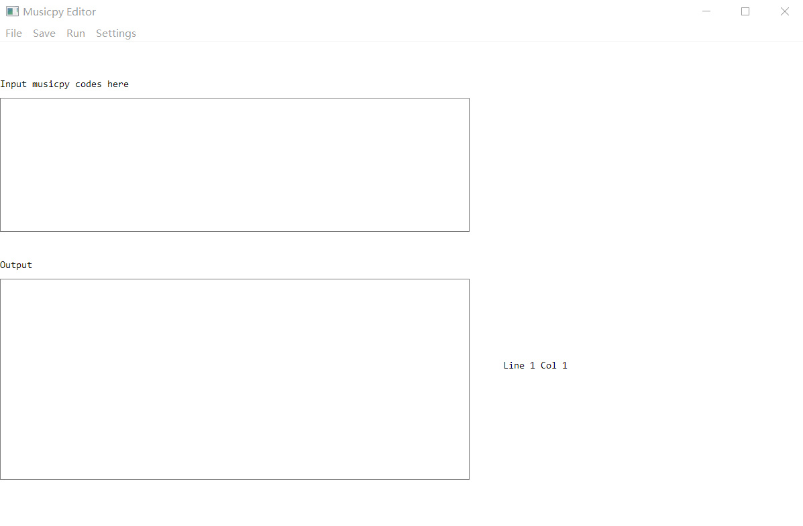

# musicpy_editor
This is an easy-to-use musicpy editor and IDE.

## Installation
Firstly,  make sure you have installed python (version >= 3.7) in your computer first.

Then run this line in cmd/terminal:
```
pip install musicpy pillow pyglet==1.5.11 yapf py
```

Then download the source codes from [here](https://github.com/Rainbow-Dreamer/musicpy_editor/archive/refs/heads/main.zip), extract the folder `musicpy editor` from the zip file, go to the `musicpy editor` folder, you can go to `English Version` folder if you want to use English version of musicpy editor or `中文版` folder if you want to use Chinese version, and then open the file `musicpy editor.pyw` in the folder you choose to use musicpy editor.

For more details including abilities and usages of this musicpy editor, see the [documentation](https://github.com/Rainbow-Dreamer/musicpy/wiki/How-to-use-musicpy#I-wrote-an-efficient-IDE-specifically-for-musicpy-for-everyone-to-use) here.


## Previews



